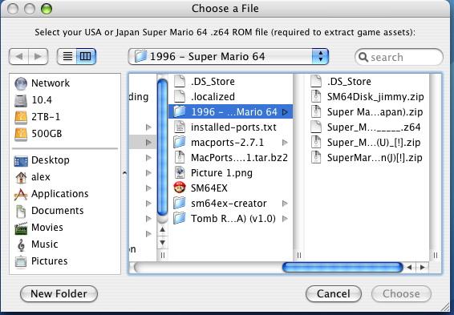
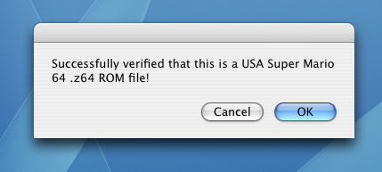
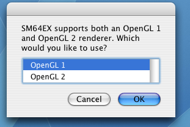
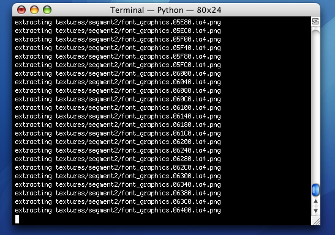
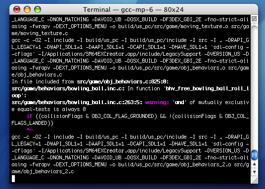
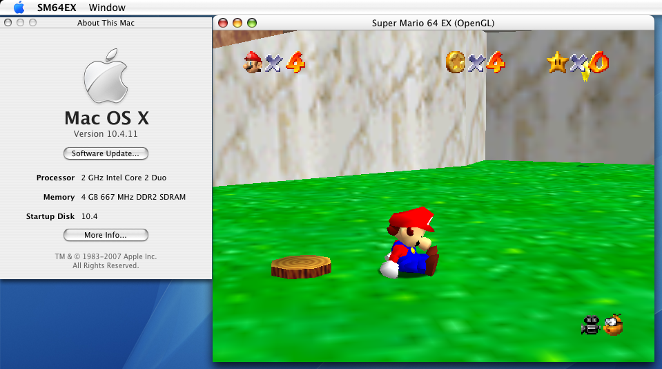

 SM64EX Creator 

[alex-free.github.io](https://alex-free.github.io/)
===================================================

Super Mario 64 EX Creator
=========================

By Alex Free

This software can create a native Super Mario 64 Port for Mac OS X 10.4 Intel Tiger on your Mac's desktop with an all in one easy to use GUI.

It compiles my fork of [SM64EX](https://github.com/alex-free/sm64ex). Currently this requires:

*   Xcode version 2.5.
*   A valid USA or Japanese Super Mario 64 .z64 ROM file (for extracting game assets).
*   An Intel Mac on Mac OS X 10.4.11 (More OS X/PowerPC specific versions are coming!)

There IS controller support available, see the [usage](#usage) section for more info

SM64EX Creator is like [sm64nxBuilder](https://sm64pc.info/sm64nxbuilder/) but for Mac OS X instead of Windows.

[Homepage](https://alex-free.github.io/sm64ex-creator) || [GitHub](https://github.com/alex-free/sm64ex-creator) || [Macintosh Garden](https://macintoshgarden.org/games/sm64ex-creator)

Table Of Contents
-----------------

*   [Download](#downloads)
*   [Installation](#install)
*   [Usage](#usage)
*   [Changlog](#changelog)
*   [Bundled Software](#bundled)
*   [License](#license)

Downloads
---------

### Version 1.0 (3/9/2022)

[SM64EX Creator v1.0](https://github.com/alex-free/sm64ex-creator/releases/download/v1.0/sm64ex_creator_1.0_tiger_i386.zip) _for Mac OS X 10.4.11 Intel Macs_

[All releases](https://github.com/alex-free/sm64ex-creator/releases)

Installation
------------

Download the latest release and extract the zip file. Copy the `SM64EXCreator.app` into the `/Applications` directory. **`SM64EXCreator.app` must be in the `/Applications` directory to work**, you will be prompted to move it there if it is not.

Usage
-----

### Building Your Own SM64EX.app With SM64EXCreator.app

Double click `/Applications/SM64EXCreator.app`. A Finder window will open, allowing you to select your Super Mario 64 `.z64` ROM file. This is required to extract the copyrighted game assets. After selecting your rom file, SM64EX Creator will verify that the ROM file is either the original Japan or USA release, and that it is in the correct .z64 format.

After that, you'll be asked what OpenGL version you want to use. The default is OpenGL 1.

Comparison

OpenGL 1

OpenGL 2

Compatibility

Works on any Mac

Not supported by most Macs

Graphical accuracy

Not as good as Open GL 2

Most accurate with least amount of glitches

Performance

Worse then OpenGL 1

Fastest option

After that, a `Terminal.app` window will open and start building SM64EX to your specifications. This will take quite a while, wait for the Terminal window to say it's done building `SM64EX.app` (which will be on your desktop).

### Using The Generated SM64EX.app

The `~/Desktop/SM64EX.app` is a portable app, the save and config files are contained within the app itself. To access them, start `SM64EX.app` and select either the `Edit Config File` or `Open Preferences Folder` option. Alternatively, you can right click `SM64EX.app` and click `Show Package Contents` to look at the files manually as well.

SM64EX supports any controller that works with SDL 1. You can even use an Xbox 360 controller if you install the Tattibogle Xbox 360 Controller OS X [Driver](https://tattiebogle.net/index.php/ProjectRoot/Xbox360Controller/OsxDriver). The important thing is to **connect the controller before starting the game**. The easist way to configure the button mappings is to mess around in the settings menu of the port.

You can access the settings menu in the port by pressing the `START` button (enter by default) once you are able to pause the game. Then press the `R` button (right shift by default). Use the control stick (WASD by default) to navigate it.

Changelog
---------

*   v1.0 (3/9/2022) - First release.

Bundled Software
----------------

SM64EX Creator contains [SDL 1.2.15](https://www.libsdl.org/release/), and it's own internal [MacPorts](https://github.com/macports/) installation, with all the software except SM64EX itself already compiled (see the list of MacPorts/LeopardPorts software installed below) due to the need of a ROM file to extract the copyrighted game assets.

Full list of installed software in the internal MacPorts prefix of `SM64EXCreator.app`:

    apple-gcc42                    @5666.3         lang/apple-gcc42
    apple-gcc42                    @5666.3         lang/apple-gcc42
    autoconf                       @2.71           devel/autoconf
    automake                       @1.16.5         devel/automake
    bzip2                          @1.0.8          archivers/bzip2
    cctools                        @949.0.1        devel/cctools
    coreutils                      @8.32           sysutils/coreutils
    curl                           @7.82.0         net/curl
    curl-ca-bundle                 @7.82.0         net/curl
    db48                           @4.8.30         databases/db48
    expat                          @2.4.7          textproc/expat
    gcc6                           @6.5.0          lang/gcc6
    gcc_select                     @0.1            sysutils/gcc_select
    gdbm                           @1.23           databases/gdbm
    gettext                        @0.21           devel/gettext
    gettext-runtime                @0.21           devel/gettext
    gettext-tools-libs             @0.21           devel/gettext
    git                            @2.35.1         devel/git
    glew                           @2.2.0          graphics/glew
    gmake                          @4.3            devel/gmake
    gmp                            @6.2.1          devel/gmp
    gperf                          @3.1            devel/gperf
    help2man                       @1.49.1         textproc/help2man
    i686-w64-mingw32-binutils      @2.37           cross/i686-w64-mingw32-binutils
    isl                            @0.24           devel/isl
    kerberos5                      @1.19.2         net/kerberos5
    ld64                           @3              devel/ld64
    ld64-97                        @97.17          devel/ld64
    legacy-support                 @1.0.4          devel/legacy-support
    libcomerr                      @1.45.6         sysutils/e2fsprogs
    libedit                        @20210910-3.1   devel/libedit
    libffi                         @3.4.2          devel/libffi
    libgcc6                        @6.5.0          lang/gcc6
    libgcc7                        @7.5.0          lang/gcc7
    libiconv                       @1.16           textproc/libiconv
    libidn                         @1.38           mail/libidn
    libidn2                        @2.3.2          mail/libidn2
    libmacho-headers               @949.0.1        devel/libmacho
    libmpc                         @1.2.1          devel/libmpc
    libpsl                         @0.21.1-20210726 net/libpsl
    libtextstyle                   @0.21           devel/gettext
    libtool                        @2.4.6          devel/libtool
    libunistring                   @1.0            textproc/libunistring
    libunwind-headers              @5.0.1          devel/libunwind
    lmdb                           @0.9.29         databases/lmdb
    lz4                            @1.9.3          archivers/lz4
    lzip                           @1.23           archivers/lzip
    m4                             @1.4.19         devel/m4
    mpfr                           @4.1.0          devel/mpfr
    mpstats                        @0.2.0          sysutils/mpstats
    ncurses                        @6.3            devel/ncurses
    openssl                        @3              devel/openssl
    openssl3                       @3.0.1          devel/openssl3
    p5.28-authen-sasl              @2.160.0        perl/p5-authen-sasl
    p5.28-b-cow                    @0.4.0          perl/p5-b-cow
    p5.28-capture-tiny             @0.480.0        perl/p5-capture-tiny
    p5.28-cgi                      @4.540.0        perl/p5-cgi
    p5.28-clone                    @0.450.0        perl/p5-clone
    p5.28-cpan-meta                @2.150.10       perl/p5-cpan-meta
    p5.28-cpan-meta-requirements   @2.140.0        perl/p5-cpan-meta-requirements
    p5.28-cpan-meta-yaml           @0.18.0         perl/p5-cpan-meta-yaml
    p5.28-devel-checkbin           @0.40.0         perl/p5-devel-checkbin
    p5.28-digest-hmac              @1.40.0         perl/p5-digest-hmac
    p5.28-digest-sha1              @2.130.0        perl/p5-digest-sha1
    p5.28-encode                   @3.160.0        perl/p5-encode
    p5.28-encode-locale            @1.50.0         perl/p5-encode-locale
    p5.28-error                    @0.170.290      perl/p5-error
    p5.28-extutils-makemaker       @7.640.0        perl/p5-extutils-makemaker
    p5.28-extutils-manifest        @1.730.0        perl/p5-extutils-manifest
    p5.28-gssapi                   @0.280.0        perl/p5-gssapi
    p5.28-html-parser              @3.760.0        perl/p5-html-parser
    p5.28-html-tagset              @3.200.0        perl/p5-html-tagset
    p5.28-http-date                @6.50.0         perl/p5-http-date
    p5.28-http-message             @6.360.0        perl/p5-http-message
    p5.28-inc-latest               @0.500.0        perl/p5-inc-latest
    p5.28-io-html                  @1.4.0          perl/p5-io-html
    p5.28-io-socket-ip             @0.410.0        perl/p5-io-socket-ip
    p5.28-io-socket-ssl            @2.74.0         perl/p5-io-socket-ssl
    p5.28-lwp-mediatypes           @6.40.0         perl/p5-lwp-mediatypes
    p5.28-module-build             @0.423.100      perl/p5-module-build
    p5.28-module-metadata          @1.0.37         perl/p5-module-metadata
    p5.28-mozilla-ca               @20211001       perl/p5-mozilla-ca
    p5.28-net-libidn               @0.120.0        perl/p5-net-libidn
    p5.28-net-smtp-ssl             @1.40.0         perl/p5-net-smtp-ssl
    p5.28-net-ssleay               @1.920.0        perl/p5-net-ssleay
    p5.28-perl-ostype              @1.10.0         perl/p5-perl-ostype
    p5.28-pod-escapes              @1.70.0         perl/p5-pod-escapes
    p5.28-pod-simple               @3.430.0        perl/p5-pod-simple
    p5.28-podlators                @4.140.0        perl/p5-podlators
    p5.28-scalar-list-utils        @1.610.0        perl/p5-scalar-list-utils
    p5.28-socket                   @2.32.0         perl/p5-socket
    p5.28-sub-name                 @0.260.0        perl/p5-sub-name
    p5.28-sub-uplevel              @0.280.0        perl/p5-sub-uplevel
    p5.28-term-readkey             @2.380.0        perl/p5-term-readkey
    p5.28-test-deep                @1.130.0        perl/p5-test-deep
    p5.28-test-exception           @0.430.0        perl/p5-test-exception
    p5.28-test-fatal               @0.16.0         perl/p5-test-fatal
    p5.28-test-needs               @0.2.9          perl/p5-test-needs
    p5.28-test-nowarnings          @1.60.0         perl/p5-test-nowarnings
    p5.28-test-warn                @0.360.0        perl/p5-test-warn
    p5.28-time-local               @1.300.0        perl/p5-time-local
    p5.28-timedate                 @2.330.0        perl/p5-timedate
    p5.28-try-tiny                 @0.310.0        perl/p5-try-tiny
    p5.28-uri                      @5.100.0        perl/p5-uri
    p5.28-version                  @0.992.900      perl/p5-version
    p5.34-locale-gettext           @1.70.0         perl/p5-locale-gettext
    pcre2                          @10.39          devel/pcre
    perl5                          @5.28.3         lang/perl5
    perl5.28                       @5.28.3         lang/perl5
    perl5.30                       @5.30.3         lang/perl5
    perl5.34                       @5.34.0         lang/perl5
    pkgconfig                      @0.29.2         devel/pkgconfig
    popt                           @1.18           devel/popt
    python3_select                 @0.0            sysutils/python3_select
    python39                       @3.9.10         lang/python39
    python310                      @3.10.2         lang/python310
    python_select                  @0.3            sysutils/python_select
    readline                       @8.1.2.000      devel/readline
    rsync                          @3.2.3          net/rsync
    sqlite3                        @3.38.0         databases/sqlite3
    texinfo                        @6.8            textproc/texinfo
    xattr                          @0.1            sysutils/xattr
    xxhashlib                      @0.8.1          devel/xxhash
    xz                             @5.2.5          archivers/xz
    zlib                           @1.2.11         archivers/zlib
    zstd                           @1.5.2          archivers/zstd

License
-------

SM64EX Creator itself is released into the public domain. The full license below is distributed with SM64EX Creator, it is **only applicable to SM64EX Creator itself and not to the SM64EX port or internal MacPorts installation and any of it's dependencies**.

    This is free and unencumbered software released into the public domain.
    
    Anyone is free to copy, modify, publish, use, compile, sell, or
    distribute this software, either in source code form or as a compiled
    binary, for any purpose, commercial or non-commercial, and by any
    means.
    
    In jurisdictions that recognize copyright laws, the author or authors
    of this software dedicate any and all copyright interest in the
    software to the public domain. We make this dedication for the benefit
    of the public at large and to the detriment of our heirs and
    successors. We intend this dedication to be an overt act of
    relinquishment in perpetuity of all present and future rights to this
    software under copyright law.
    
    THE SOFTWARE IS PROVIDED "AS IS", WITHOUT WARRANTY OF ANY KIND,
    EXPRESS OR IMPLIED, INCLUDING BUT NOT LIMITED TO THE WARRANTIES OF
    MERCHANTABILITY, FITNESS FOR A PARTICULAR PURPOSE AND NON-INFRINGEMENT.
    IN NO EVENT SHALL THE AUTHORS BE LIABLE FOR ANY CLAIM, DAMAGES OR
    OTHER LIABILITY, WHETHER IN AN ACTION OF CONTRACT, TORT OR OTHERWISE,
    ARISING FROM, OUT OF OR IN CONNECTION WITH THE SOFTWARE OR THE USE OR
    OTHER DEALINGS IN THE SOFTWARE.
    
    For more information, please refer to http://unlicense.org
